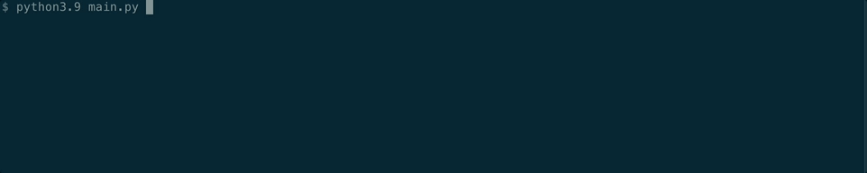

# Multi-Hash
[](https://www.python.org/downloads/release/python-390/) 

## Create multiple hashes from file
### Supported hashing algorithms:
    CRC32, MD5, SHA1, SHA256, SHA512, sha3_512

**Preview**


**Installation:**
pip install -r requirements.txt

**Requirements:**

[tqdm](https://github.com/tqdm/tqdm)

[zlib](https://github.com/madler/zlib)

**Sample hashlog.txt output:**
```
File : test.png
Size : 28787 byte
CRC32: de4585b2
md5: 235781829ac89d598787934ec47c50e0
sha1: dbb004562359f27910cc8dca0842e85ee2c78054
sha256: e7bf454a9ccc70324397de1c8632f5597440e6ef8ca25827178b8bdf7c7b389c
sha512: d610c692aad663431b1a955ffb01f94bd01f8b4e03cfb4bd17c82deed80725d916f4bc704487037fd51740a510d89d40a1d9d41023780598ebc936792448e5f4
sha3_512: e114a708153c1c388d5410a5660f98abecca21ad70781649c7c700d16c017195e38a848b8c0aa43a01a422d2bd5b0cf246b37ed43ddc8e65e1fd9435020fd52b
```

**Todo:**
- [ ] Add hash-check verification
- [ ] Add batch mode for multiple files
- [X] Add gif to Readme
- [X] Test on macOS and Linux
- [X] Publish version 1.0 :tada:


